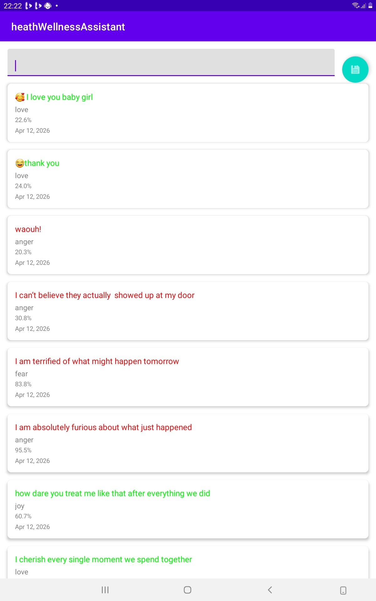

# HeathWellnessAssistant (AI‑Powered Journal)

An Android application that uses a Deep Learning LSTM model to analyze emotional sentiment in journal entries in real‑time. The app helps users track their mood patterns over time and visualize their emotional journey through a clean, Material‑Design UI.

---

## 🧠 The AI Engine

- **Architecture**:  
  - **Bi‑Directional LSTM** (Long Short‑Term Memory) for sequence‑aware text classification.  
  - Two stacked bidirectional LSTM layers for better long‑term context and emotional nuance.

- **Dataset & Training**:  
  - Trained on the **Kaggle "Emotion Dataset"** (≈16,000+ labeled sentences).  
  - Train/Validation/Test split for proper evaluation.  
  - Early stopping and learning‑rate reduction during training for better generalization.

- **Model Format**:  
  - Exported to **TensorFlow Lite** (`emotion_model_v2.tflite`) for on‑device inference.  
  - Uses **Flex Delegate** (`SELECT_TF_OPS`) to support LSTM layers not available in pure TFLite.

- **Input/Output**:  
  - **Input**: Numeric 1D tokenized array of **100 integers** (text → `TextVectorization` → `int[100]`).  
  - **Output**: 6‑class softmax probabilities for emotions:
    - `sadness`  
    - `joy`  
    - `love`  
    - `anger`  
    - `fear`  
    - `surprise`  

- **Vocabulary & Metadata**:  
  - Vocabulary exported as `vocab.json` (`word → index` mapping) and embedded in the app.  
  - Model configuration (labels, accuracy, version) stored in `model_metadata.json` for future reference.

---

## 🏗️ Android Architecture

- **Language**:  
  - **Java** (core Android code).  
  - Clean separation between UI, business logic, and AI.

- **Architecture Pattern**:  
  - **MVVM** (Model‑View‑ViewModel) with `ViewModel`‑driven UI updates.  
  - Observers and `LiveData` for smooth UI‑data synchronization.

- **Data Persistence**:  
  - **Room Persistence Library** (SQLite) to store journal entries and their predicted emotions.  
  - Entity: `Emotion` (text, emotion label, confidence, timestamp).  
  - DAO‑based repository pattern for database operations.

- **Threading & Async**:  
  - **`ExecutorService`** for background processing of:
    - TensorFlow Lite inference  
    - Room database inserts and queries  
  - No blocking on the main thread; UI remains responsive.

- **UI & Navigation**:  
  - **ConstraintLayout** with Material Design Components:
    - `TextInputLayout` + `TextInputEditText` for journal input.  
    - `FloatingActionButton` for saving entries.  
    - `RecyclerView` to display a history of analyzed emotions.  
  - Items are auto‑scrolled to the bottom so the latest emotion is always visible.

- **AI Integration**:  
  - `TfLiteSentimentAnalyzer` class that:
    - Loads `emotion_model_v2.tflite` with `FlexDelegate`.  
    - Preprocesses text (lowercase, punctuation removal, tokenization) to match Python `TextVectorization`.  
    - Maps integer‑tokenized input to emotional labels and confidence scores.  
  - Predictions are recorded in Room for later review.

---

## 📊 Features

- **Real‑Time Emotion Prediction**:  
  - As you type or edit a journal entry, the app predicts the dominant emotion and confidence.

- **Emotion History Dashboard**:  
  - `RecyclerView` displays past entries with:
    - Original text  
    - Predicted emotion  
    - Confidence percentage  
    - Timestamp  
  - Newest entries always appear at the bottom and are auto‑scrolled into view.

- **Offline‑First**:  
  - AI model runs fully **on‑device** (no internet required).  
  - All data stored locally in Room; no server dependency.

- **Extensible & Maintainable**:  
  - Clean `ViewModel` layer isolates AI logic from UI concerns.  
  - Easy to swap or upgrade the model by replacing `emotion_model_v2.tflite` and `vocab.json`.

---

## 🛠️ Installation & Setup

1. **Clone the Repository**  
   ```bash
   git clone https://github.com/<your-username>/HeathWellnessAssistant.git
   cd HeathWellnessAssistant
   ```

2. **Model Assets**  
   Ensure the following files are in `app/src/main/assets/`:
   - `emotion_model_v2.tflite` – TensorFlow Lite model.  
   - `vocab.json` – Vocabulary mapping (`word → index`).  
   - `model_metadata.json` – Model labels and configuration.

3. **Gradle Dependencies**  
   Add TensorFlow Lite Flex Delegate to your `app/build.gradle`:

   ```gradle
   dependencies {
       implementation 'org.tensorflow:tensorflow-lite:2.14.0'
       implementation 'org.tensorflow:tensorflow-lite-select-tf-ops:2.14.0'
   }
   ```

4. **Run the App**  
   - Open the project in Android Studio.  
   - Build and run `app` on an emulator or physical device.

---

## 📸 Screenshots 





---

## 🚀 Future Improvements

Since the **journaling path is 100% complete and verified**, here are the planned expansions:

### 1. **Scale the Architecture**  
   - **Meal Photo Estimator** using **Camera API** + **Image Classification**  
     - Snap photo → AI estimates calories/nutrients  
     - Add to daily meal log → track nutrition alongside mood

### 2. **Add CRUD Depth**  
   - **"Long Press to Delete"** feature in Journal list  
     - Swipe or long‑press → delete individual entries  
     - Confirmation dialog + undo option

### 3. **Visual Analytics**  
   - **Sentiment Trend Charts** over the last 7 days  
     - Line/bar charts showing mood patterns (MPAndroidChart)  
     - Weekly summaries: "You had 4 joy, 2 anger, 1 fear days"  
     - Exportable reports (PDF/CSV)

### 4. **Performance & Polish**  
   - **Model Optimization**: Explore smaller transformer models  
   - **Multi‑language**: Spanish/Arabic support for global audiences  
   - **Backup**: Google Drive sync for journal data

---

## 📦 License

MIT License – see `LICENSE` for details.
